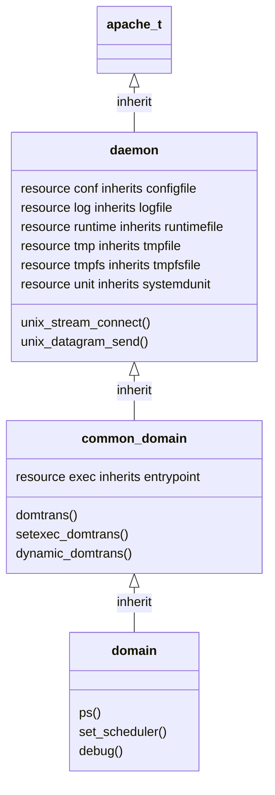

# Domain Design

The following diagram illustrates the inheritance of the apache_t domain.

## domain (Virtual)

This is the base virtual for domains in the Cascade language.  Refpolicy
adds many functions to this built in virtual, but no rules are added. This
enables use of the domain virtual to build new domains starting with zero
rules. If you are creating a new domain, you most likely want to use
`common_domain` or one of its sub-virtuals as a starting point instead.
The functions added to `domain` can be found in `domain_api.cas`.

## common_domain (Virtual)

This is the base virtual for domains in refpolicy.  Several rules common
to domains are added here, along with an entrypoint file type for the domain.
This can be found in `domain.cas`.

## daemon (Virtual)

This virtual provides private resources and common access for long running
non-interactive system processes/services/daemons.  It provides several
private types, such as configuration files, log files, and tmp files.
This can be found in `init.cas` and is extended by init programs in
`sysvinit.cas` and `systemd.cas`.

## apache_t

This is the concrete domain for the apache daemon.
