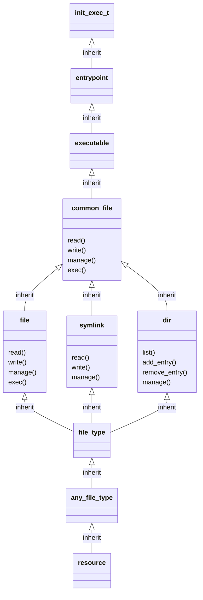

# File Design

The following diagram illustrates the inheritance of the init_exec_t
type, which is the entrypoint for the init_t domain.

## resource (Virtual)

This is the base virtual for resources in the Cascade language.  Refpolicy
uses this virtual unmodified.

## any_file_type (Virtual)

This is the base virtual for all file-like objects, including device nodes.
This can be found in `file_low_api.cas`.

## file_type (Virtual)

This is the base virtual for file-like objects, excluding device nodes.
This can be found in `file_low_api.cas`.

## file, symlink, dir (Virtual)

These virtuals have a 1:1 correspondence with object claasses. They provide
functions for access patterns specific to the object class. The remaining
file-like object classes also have corresponding virtuals, which can be
found in `file_low_api.cas` and `device_api.cas`.

## common_file (Virtual)

This virtual seeks to provide common access patterns between the inherited
object classes. This is similar to the refpolicy2 pattern macros such
as `read_files_pattern()`. The remaining file-like object classes also
have corresponding virtuals, which can be found in `file_high_api.cas`
and `device_api.cas`.

## executable, entrypoint (Virtual)

These virtuals are examples of logical groupings of resources.  Most
file-based groups can be found in `files.cas`.

## init_t.exec/init_exec_t

This is the concrete type.
