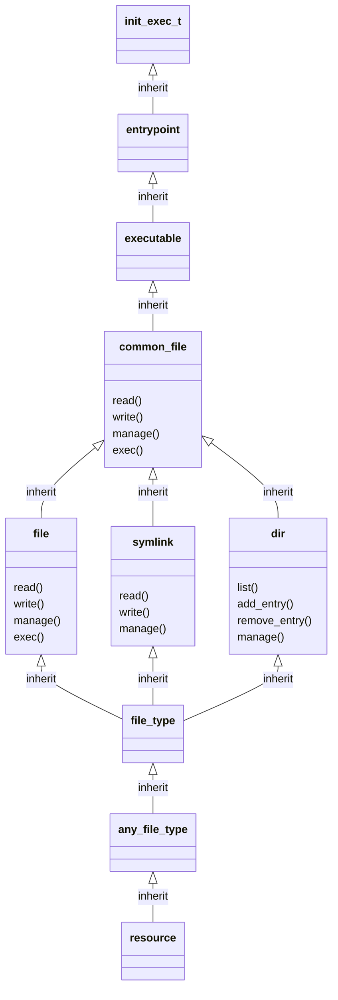

# File Design

## Concept

In refpolicy3, one goal is to further abstract acceess details to make it
easier for users that are not security experts nor SELinux experts to make
policy changes.  The file virtual design extends the ideas from refpolicy2's
file pattern macros, such as `read_files_pattern`, by incorporating directory
and symbolic link access into each of the "common" virtuals, such as
`common_file` and `common_pipe`.  Thus, when creating a new file type,
inheriting one or more of the common file virtuals or one of their subvirtuals
is best in most cases.

## File High-Level Design

Each common file virtual inherits the corresponding low level virtual along
with the `dir` and `symlink` virtuals.  For example, `common_file` inherits
`file`, `symlink`, and `dir`.  From these virtuals, the standard set of
functions for files are created.  For example, the `common_file::read()`
function provides read access on files, read access on symlinks, and list(read)
access on directories.  There are two exceptions.  First, the `common_dir` only
inherits `dir` and `symlink`.  Second, there is no `common_symlink` virtual.

The implementation of these virtuals can be found in `file_high_api.cas`.
Implementation for device nodes can be found in `device_api.cas`.

The behavior of each file type is expressed by what virtuals the type
inherits.  For example, if you have a `foo_t` file type that will consist of
directories, files, and pipes, the `common_file` and `common_pipe` virtuals
(or one of their sub-virtuals) are inherited.  Then callers simply
call `foo_t.read()` to read files or pipes.

There may be concerns with knowing what access is being provided by a call or
this behavior allowing excessive access.  All files with the same context have
the same security properties by definition, regardless of the object class.  If
the objects truly need to be separated, they should have different contexts.
However, if object class separation is desired, this is still achievable.
The Cascade language provides options:

1. Virtual-specific function call, such as `foo_t<common_file>.read()`.
2. Write a custom function for `foo_t`, either overriding the `read()` function
   or providing a new function.
3. Delete unnecessary acccess using the `delete()` function.
4. Write explicit `allow()` rules.

The hope is for future tooling to insight into the implementation of the
functions so policy writers can make good decisions based on their security
requirements.

## File Low-Level Design

These virtuals have a 1:1 correspondence with object claasses. They provide
functions for access patterns specific to the object class, such as
`read_file_perms` for `read()` and `manage_file_perms` for `manage()`.

The implementation of these virtuals can be found in `file_low_api.cas`.
Implementation for device nodes can be found in `device_api.cas`.

## Example Inheritance Diagram

The following diagram illustrates the full inheritance of the init_exec_t
type, which is the entrypoint for the init_t domain.  Listed functions are
representational; more functions are defined than are depicted in the diagram.

### resource (Virtual)

This is the base virtual for resources in the Cascade language.  Refpolicy
uses this virtual unmodified.

### any_file_type (Virtual)

This is the base virtual for all file-like objects, including device nodes.
This can be found in `file_low_api.cas`.

### file_type (Virtual)

This is the base virtual for file-like objects, excluding device nodes.
This can be found in `file_low_api.cas`.

### file, symlink, dir (Virtual)

These virtuals have a 1:1 correspondence with object claasses. They provide
functions for access patterns specific to the object class. The remaining
file-like object classes also have corresponding virtuals, which can be
found in `file_low_api.cas` and `device_api.cas`.

### common_file (Virtual)

This virtual seeks to provide common access patterns between the inherited
object classes. This is similar to the refpolicy2 pattern macros such
as `read_files_pattern()`. The remaining file-like object classes also
have corresponding virtuals, which can be found in `file_high_api.cas`
and `device_api.cas`.

### executable, entrypoint (Virtual)

These virtuals are examples of logical groupings of resources.  Most
file-based groups can be found in `files.cas`.

### init_t.exec/init_exec_t

This is the concrete type found in `init.cas`.
